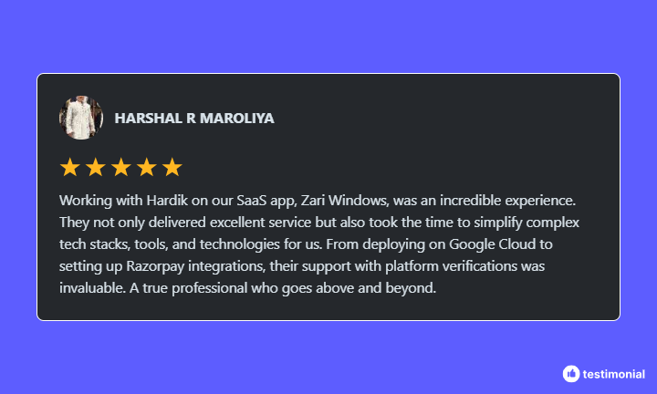

## Hi there 👋

    

## 🙋‍♂️ About Me 

I help businesses grow and optimize their operations with custom multi-platform software solutions designed to meet specific needs. Whether you’re launching your next big idea or struggling to manage your business remotely, I bring the expertise to turn your vision into reality. With experience in designing, developing, and deploying software, I take a data-driven approach to ensure impactful results. For instance, I’ve successfully launched solutions that improved operational efficiency for clients and enhanced user satisfaction.

## 🚀 Skills
<ul>
<li><b>𝗔𝗿𝗰𝗵𝗶𝘁𝗲𝗰𝘁𝘂𝗿𝗲 𝗗𝗲𝘀𝗶𝗴𝗻:</b> Crafting scalable, efficient, and maintainable software solutions. </li>
<li><b>𝗙𝗶𝗿𝗲𝗯𝗮𝘀𝗲:</b> Proficient in authentication, cloud storage, remote config, and hosting. </li>
<li><b>𝗣𝗮𝘆𝗺𝗲𝗻𝘁 𝗚𝗮𝘁𝗲𝘄𝗮𝘆𝘀:</b> Integration of secure payment systems like Razorpay. </li>
<li><b>𝗗𝗮𝘁𝗮𝗯𝗮𝘀𝗲 𝗠𝗮𝗻𝗮𝗴𝗲𝗺𝗲𝗻𝘁:</b> Expertise in MongoDB and cloud databases for robust backend systems. </li>
<li><b>𝗖𝗹𝗼𝘂𝗱 𝗣𝗹𝗮𝘁𝗳𝗼𝗿𝗺𝘀:</b> Deployment and hosting on Google Cloud Platform (GCP) and AWS. </li>
<li><b>𝗖𝗿𝗼𝘀𝘀-𝗣𝗹𝗮𝘁𝗳𝗼𝗿𝗺 𝗗𝗲𝘃𝗲𝗹𝗼𝗽𝗺𝗲𝗻𝘁:</b> Creating high-performance apps with Flutter for iOS, Android, and Windows. </li>
<li><b>𝗔𝗣𝗜 𝗮𝗻𝗱 𝗠𝗮𝗽 𝗜𝗻𝘁𝗲𝗴𝗿𝗮𝘁𝗶𝗼𝗻:</b> seamless integration of APIs, maps, and advanced features. </li>
<li><b>𝗔𝗜 𝗖𝗵𝗮𝘁𝗯𝗼𝘁 𝗜𝗻𝘁𝗲𝗴𝗿𝗮𝘁𝗶𝗼𝗻:</b> Building intelligent chatbots to enhance user experience. </li>
<li><b>𝗨𝗜/𝗨𝗫 𝗗𝗲𝘀𝗶𝗴𝗻:</b> Delivering intuitive app interfaces and exceptional user experiences. </li>
</ul>

## 🏆 Reviews

  

## 🎯 Languages and Frameworks:

       

## 🛠 Tools:

       

## 🔗 Connect With me:

    
    
    

